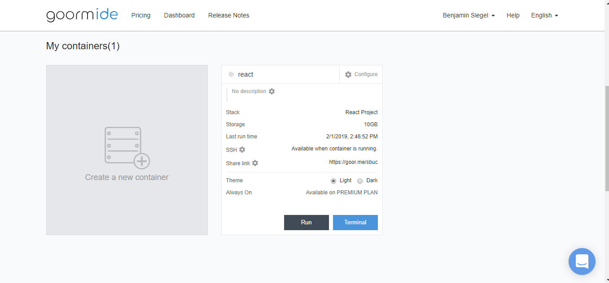
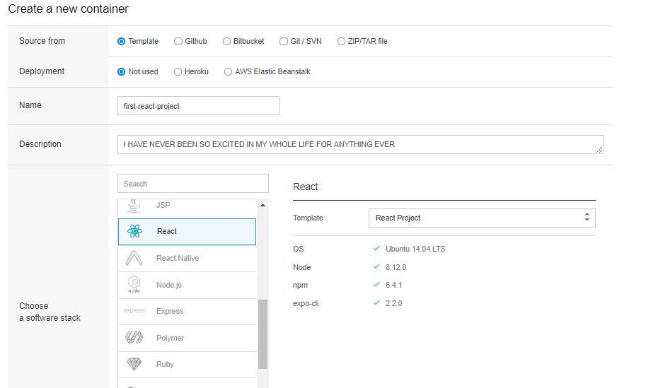
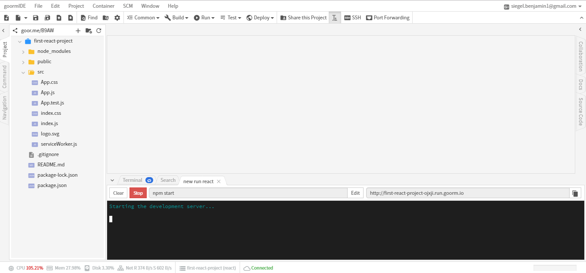

# React Setup

## Learning objectives
* SWBAT set up a React project using the Goorm! IDE
* SWBAT edit the React starter page to display HTML they have written
* SWBAT identify why React is a popular front-end development framework

## Sequence

1. [Launch](#launch)
2. React Setup
4. [Close](#close)

## Launch
React is one the most popular frameworks used today for front-end development. React was developed by Facebook to simplify the process of building a large, complex web-application.
Before we get started learning how to build our own React application, lets try and find some other website that are built with React. Try and find as many sites as you can in the next 5 minutes (try and find less known websites that use React). Write them down - we will use this list later!

#### Questions for Students
 > * What are five websites you found that use React?
 > * Why do you think these websites use React rather than other frameworks?

## React Setup
Now that we have a list of websites that use React, it's time to setup our first React project!

### Stay Calm
When you first set up a React project you will see tons of files installed in your file tree. Don't worry! Most of these files you will never need to look at. They are there to translate the code you write to code the browser can read. React is actually very easy to use as you will soon see. I promise!

#####Step 1
Create a new container in Goorm.

#####Step 2
Choose React as your software stack.

#####Step 3
Open the "src" directory in your project. Then, open App.js and look at the code written in the file. This file contains the code on what the user will see. Take a guess what you might see when you run this code. Then, run the code by clicking the "Run" button from the top of the menu. After you press "Run" a link will appear on the lower right side of your screen. Copy that link into a new tab and take a look!

#####Step 4
You should see a page that looks like this. Was it as you expected? Also - notice how it tells us to edit src/App.js - lets try it out and see what happens.

#####Step 5
Go back to the App.js file and delete the code inside of the div with the class name "App." Try adding your own HTML code inside of this div and see how it changes the website preview you were looking at earlier.

#### Mini-challenges
* Add an h1 tag with the text "Why React Is Awesome" to the React Website
* Google some reasons why react is so awesome. Add a p tag to the website summarizing what you learned about React's awesomeness
* Create an unordered list with all the websites you found that use react
* Extension - Style the page using the index.css file

## Close
Gather student feedback
