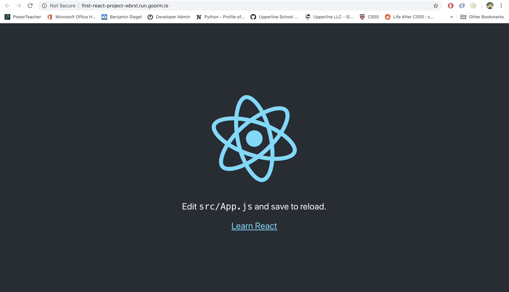
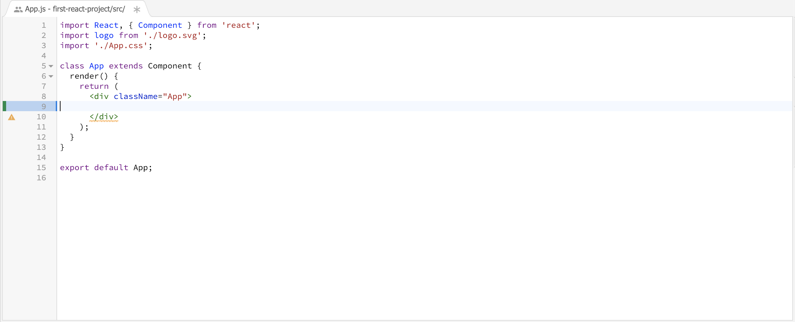
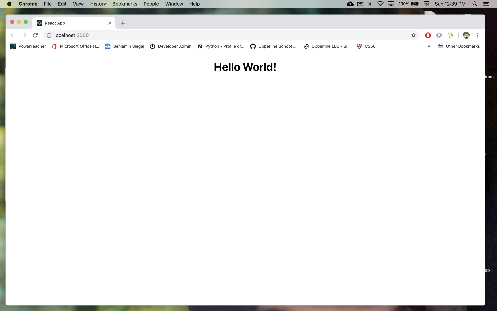

# React Setup

## Learning objectives
* SWBAT set up a React project locally on personal computer or Goorm IDE
* SWBAT edit the React starter page to display HTML they have written
* SWBAT identify why React is a popular front-end development framework

## Sequence

1. [Launch](#launch)
2. [React Setup - Local](#local)
3. [Rect Setup - Goorm](#Goorm)
4. [Close](#close)


## Launch
React is one the most popular frameworks used today for front-end development. React was developed by Facebook to simplify the process of building a large, complex web-application.
Before we get started learning how to build our own React application, lets try and find some other website that are built with React. Try and find as many sites as you can in the next 5 minutes (try and find less known websites that use React). Write them down - we will use this list later!


#### Questions for Students
 > * What are five websites you found that use React?

## React Setup
Now that we have a list of websites that use React, it's time to setup our first React project!

### Stay Calm
When you first set up a React project you will see tons of files installed in your file tree. Don't worry! Most of these files you will never need to look at. They are there to translate the code you write to code the browser can read. React is actually very easy to use as you will soon see. I promise!

## Local Setup

#### Step 1
First you need to check if you have Node installed on your computer. You can check by typing the following into your terminal.

```HTML
npm -v
```

You should have Node 5.2 or higher installed. If it tells you Node is not installed please go to https://nodejs.org and installed the latest version.

#### Step 2
Once Node is installed, run each of the following lines of code in your terminal:

```HTML
npx create-react-app first-react-app
cd my-app
```

The first command tells node where to find the files on the internet to create a new React project and install those files on your computer. You will see we also typed in "first-react-app". This will be the name of the project we create as well as the directory where the files are installed. You can name this project anything as long as there are no spaces or special characters. We could have named it "cat-lovers-website" or "best_dressed_robots".

#### Step 3
Type the following line of code into your terminal:

```HTML
npm start
```

This command tells Node to begin running the React program we have created. You should see the following message in your terminal:


As instructed, lets view our app using the link provided. Open your browser and visit http://localhost:3000/ (or whatever address is provided in your terminal) to see what our React application looks like.

#### Step 4
You should see a page that looks like this. Pretty cool, right? Also - notice how it tells us to edit src/App.js - lets try it out and see what happens.


#### Step 5
Open directory that contains your React project in your code editor. Find the App.js file in the "src" directory. Delete the code inside of the div with the class name "App."



Try adding some HTML to get "Hello World" to appear on the web page instead!




## Goorm Setup

#### Step 1
Create a new container in Goorm.


#### Step 2
Choose React as your software stack.


#### Step 3
Open the "src" directory in your project. Then, open App.js and look at the code written in the file. This file contains the code on what the user will see. Take a guess what you might see when you run this code. Then, run the code by clicking the "Run" button from the top of the menu. After you press "Run" a link will appear on the lower right side of your screen. Copy that link into a new tab and take a look!


#### Step 4
You should see a page that looks like this. Was it as you expected? Also - notice how it tells us to edit src/App.js - lets try it out and see what happens.


#### Step 5
Go back to the App.js file and delete the code inside of the div with the class name "App."


Try adding some HTML to get "Hello World" to appear on the web page instead!

Try adding some HTML to get "Hello World" to appear on the web page instead!


#### Mini-challenges
* Add an h1 tag with the text "About YOUR_NAME" within the div with the class "App." Obviously, replace YOUR_NAME with your actual name.
* Create a short About Me page. This page should include your favorite quote, your nick name, and a list of activities you enjoy.
* Extension - Style the page using the index.css file


## Close
Pose the questions below for a quick discussion. As always, collect student feedback at the end of the lesson.

##### Questions
* Do you think that every time a user signs up for Facebook, an engineer at Facebook must program a new user page? If not, what do you think happens?

* Based on the answer to the question above, name a website you found that is built with React and explain why they might have used React to build their website.
